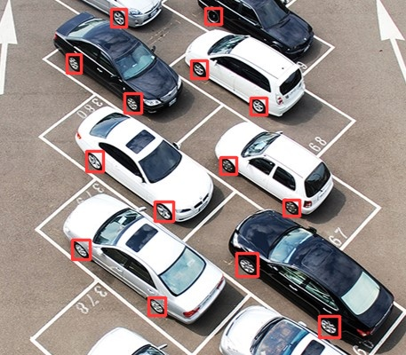
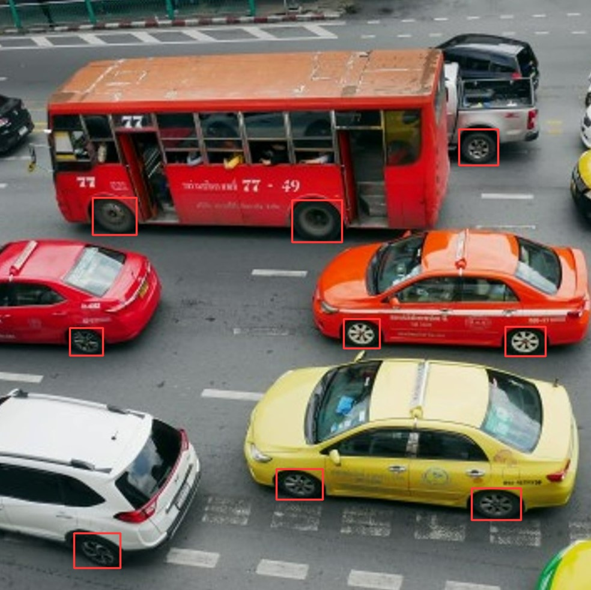
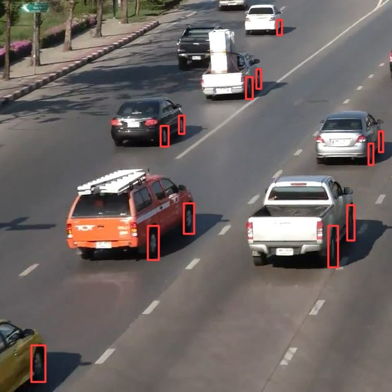
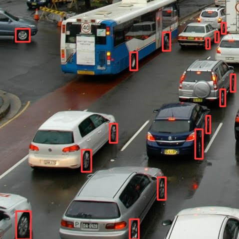
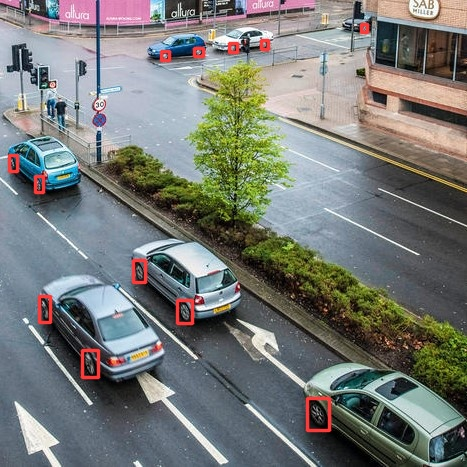
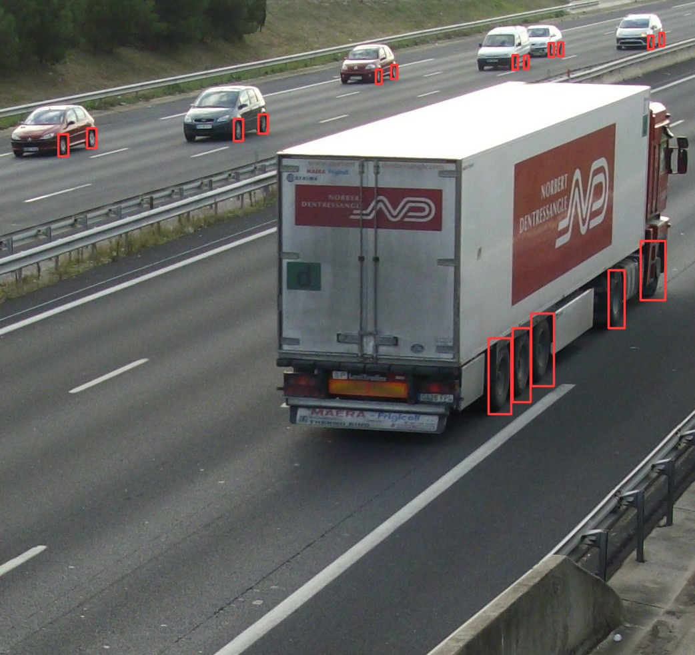
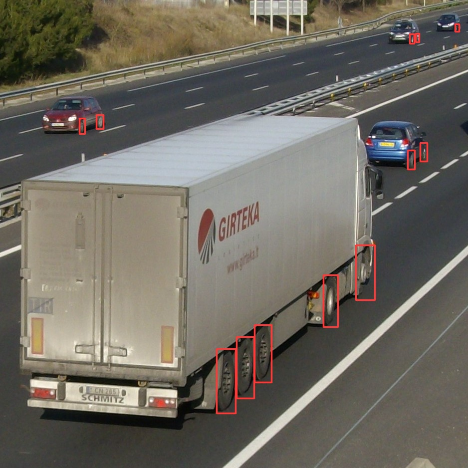

<details open>
<summary>Install</summary>
Development and Testing were done on Windows 10

Requirements:
[**Python>=3.6.0**](https://www.python.org/) is required for all \
[**PyTorch>=1.7**](https://pytorch.org/get-started/locally/) is required for YOLOv5 \
[**Git>=2.33.0**](https://www.python.org/) is required to fetch the YOLOv5 \
[**YOLOv5>=6**](https://github.com/ultralytics/yolov5/tree/v6.0) is required for training and running wheel_detector\
[**LabelImg**](https://github.com/tzutalin/labelImg) is required for labeling images for training

Installing PyTorch

Development was done using Nvidia CUDA 11.3

```
pip3 install torch==1.10.0+cu113 torchvision==0.11.1+cu113 torchaudio===0.10.0+cu113 -f https://download.pytorch.org/whl/cu113/torch_stable.html
```

Installing YOLOv5
```
git clone https://github.com/ultralytics/yolov5/tree/v6.0
cd yolov5
pip install -r requirements.txt
```
Installing LabelImg

```
pip3 install labelImg
```
or automatic using

```
.\install.cmd
```
</details>

<details open>
<summary>Directory Structure</summary>

```
wheel_detector
 ┣ data
    ┗ images
    ┗ labels
 ┣ data_split          # generated on the fly, contians train/validate
 ┣ test
 ┣ wheel_detector      # generated on the fly, contains wheel_model from trainng)
 ┣ classes.txt
 ┣ detect.cmd
 ┣ install.cmd
 ┣ README.md
 ┣ split.cmd
 ┣ split_data.py
 ┣ wheel_dataset.yaml   # defines the location of the data for YOLOv5
 ┣ wheel_detector.pt    # final model, can be used as base for deployment training
 ┗ wheel_detector.yaml  # model defintion, defines the layers of the model
```
</details>


<details open>
<summary>Detect</summary>

Run command:

detect.cmd is a windows batch script with all the parameters
by default .\output is where the output image results with labels 

```
.\detect.cmd [image_directory_path] [detection_run_name]
```

example: 

```
.\detect.cmd .\test test_run1
```

after running command the output results goes in \output directory with same folder name as specified detection_run_name

</details>

<details open>


<details open>
<summary>Split Data</summary>

Randomly splitting the data

Run command:

images and labels expected to be inside \data directory
```
.\split.cmd
```

after running .\split.cmd the \data_split gets generated with train and validate folders

</details>

<summary>Train</summary>
Before training make sure you run .\split.cmd to split the data 
and generate data_spit\train and data_split\validate

Run command:

#### default values for small dataset:
img_input_size = 512  \
num_batch = 4 \
num_epoch = 1000 

```
.\train.cmd [img_input_size] [num_batch] [num_epochs]
```

example:
```
.\train.cmd 512 4 1000
```
</details>

<details open>
<summary>Label Images</summary>

classes.txt contains the class name of the detector, in this case it't 'wheel'

make sure classes.txt in the root and inside /data/labels directory 

Run command:

```
labelImg .\data\images\ classes.txt .\data\labels\
```

to make things easy, make sure you select auto save mode option under view menu

</details>

## Detection Demo








